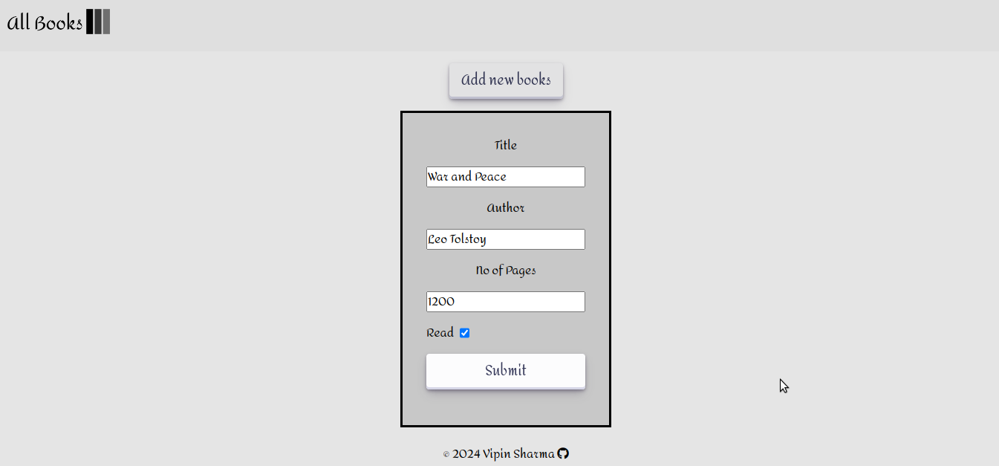

## My submission for the Library App  project in the Javascript Course on The Odin Project. 

### Solution Links

- Live Site URL: [https://vipinsharmaa.github.io/Odin-Library/](https://vipinsharmaa.github.io/Odin-Library/)
- Solution URL: [https://github.com/vipinsharmaa/Odin-Library](https://github.com/vipinsharmaa/Odin-Library)

### Screenshot

### Built with

- Semantic HTML5 markup
- CSS Grid
- Flexbox
- Javascript

## Authors

- Twitter - [@codecrash007](https://www.twitter.com/codecrash007)
- GitHub  - [@vipinsharmaa](https://github.com/vipinsharmaa)

